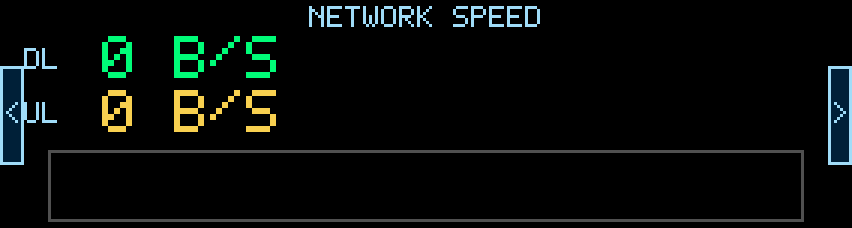
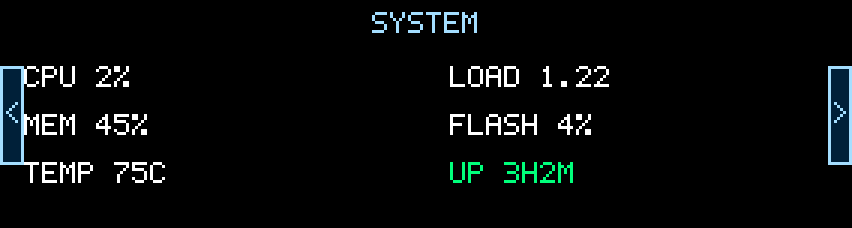
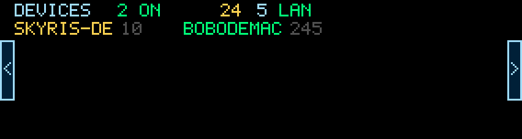
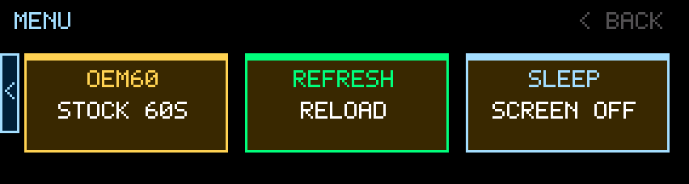

# GL-BE3600 屏幕工具

*[English](README.md) | [中文](README_ZH.md)*

针对 GL.iNet BE3600 / IPQ5332 路由器触摸屏的自定义屏幕实验。

## 硬件信息

在 `192.168.3.1` 上观察到：

- 型号：`GL.iNet BE3600, Inc. IPQ5332/AP-MI04.1-C2`
- 原厂屏幕进程：`/usr/bin/gl_screen -c /tmp/gl_screen/config`
- 帧缓冲：`/dev/fb0`
- 帧缓冲 sysfs：
  - `virtual_size=76,284`
  - `stride=152`
  - `bits_per_pixel=16`
  - 驱动名称：`fb_st7789p3`
- 视觉设计为横屏 `284x76`；写入帧缓冲时需要顺时针旋转成 `76x284`。
- 像素格式：RGB565 小端。
- 触摸设备：`/dev/input/event0`
- 触摸名称：`Hynitron CST816X Touchscreen`

## 当前脚本

`src/skyris_screen_clients.lua` 绘制一个小型的在线客户端仪表盘，分为**五个可滑动的页面**。
**左滑/下滑**进入下一页，**右滑/上滑**返回上一页；屏幕左右边缘还有可点击的
**`<` / `>` 翻页按钮**（仅在该方向存在页面时显示），点击即可翻页。

1. **首页（Home）** —— 干净的总览：标题、大号在线设备数、各接口计数（`2.4G`、`5G`、`cable`）。
2. **网速（Network speed）** —— 实时 WAN 上下行速率（自动 B/KB/MB 单位）。
3. **系统（System）** —— CPU 占用、内存占用、温度、负载、闪存使用率、运行时长；
   CPU / 内存 / 温度超过阈值时变红告警。
4. **设备（Devices）** —— 完整客户端列表，每页 18 个、三列显示（名称 + IP 尾号）。
   设备较多时自动翻页，右上角显示 `当前页/总页数`，滑动即可翻页（例如 100 个设备 = 6 页）。
5. **菜单（Menu）** —— 美化的功能按钮，每个都带简短说明。点击按钮：
   - `OEM60` —— 恢复原厂屏幕 60 秒，然后切回。
   - `REFRESH` —— 立即重新加载客户端数据。
   - `SLEEP` —— 立即息屏。

### 界面截图

| 首页 | 网速 | 系统 |
|------|------|------|
|  |  |  |

| 设备 | 菜单 |
|------|------|
|  |  |

其他行为：

- 自动刷新守护进程每 5 秒重绘当前页面。
- 遵循原厂屏幕设置，直接从 uci 实时读取，与 GL 后台设置完全一致：
  - **亮度 / 自动锁屏（熄屏）超时 / 常亮**（`gl_screen.generic`）。自动锁屏后第一次触摸只唤醒屏幕。
  - **定时开关屏**（`gl_timer.screen`）：在选定星期、配置的开启时段之外屏幕熄灭，时段开始时自动点亮。定时优先于"常亮"，所以夜间定时关屏依然生效。
- 守护进程把自己的 PID 记录在 `/tmp/skyris_screen_clients.pid`；重新启动会干净地替换正在运行的实例，`stop` 能可靠地结束它（这台路由器的 busybox 没有 `pkill`）。

## 安装到路由器

```sh
./scripts/install.sh root@192.168.3.1
```

该脚本会把屏幕程序复制到 `/usr/bin/skyris_screen_clients`，把 procd 启动脚本安装到
`/etc/init.d/skyris_screen_clients`，**启用开机自启**，并（重新）启动服务。

或手动：

```sh
scp src/skyris_screen_clients.lua root@192.168.3.1:/usr/bin/skyris_screen_clients
scp scripts/skyris_screen_clients.init root@192.168.3.1:/etc/init.d/skyris_screen_clients
ssh root@192.168.3.1 'chmod +x /usr/bin/skyris_screen_clients /etc/init.d/skyris_screen_clients && /etc/init.d/skyris_screen_clients enable && /etc/init.d/skyris_screen_clients start'
```

如果因为路由器缺少 `sftp-server` 导致 `scp` 失败，请使用安装脚本，它通过 SSH 流式写入。

## 运行

安装后，作为服务管理（重启后仍会自动运行）：

```sh
ssh root@192.168.3.1 '/etc/init.d/skyris_screen_clients start'    # 立即启动
ssh root@192.168.3.1 '/etc/init.d/skyris_screen_clients stop'     # 停止并把屏幕交还原厂
ssh root@192.168.3.1 '/etc/init.d/skyris_screen_clients restart'  # 重启
ssh root@192.168.3.1 '/etc/init.d/skyris_screen_clients disable'  # 取消开机自启
```

程序本身也提供更底层的命令（供 init 脚本调用，以及调试用）：

显示一次：

```sh
ssh root@192.168.3.1 '/usr/bin/skyris_screen_clients once'
```

渲染单个页面后退出（0 = 首页，1 = 网速，2 = 系统，之后是设备页，最后是菜单）—— 方便调试：

```sh
ssh root@192.168.3.1 '/usr/bin/skyris_screen_clients once 2'
```

直接运行刷新守护进程（不受 procd 管理 —— 建议优先用上面的 init 服务）：

```sh
ssh root@192.168.3.1 '/usr/bin/skyris_screen_clients daemon >/tmp/skyris_screen_clients.log 2>&1 &'
```

恢复原厂 GL.iNet 屏幕：

```sh
ssh root@192.168.3.1 '/usr/bin/skyris_screen_clients stop'
```

临时显示原厂屏幕 60 秒：

```sh
ssh root@192.168.3.1 '/usr/bin/skyris_screen_clients oem60'
```

## 原厂屏幕分析

从路由器复制出的二进制：`/usr/bin/gl_screen`。

在原厂二进制中观察到的关键字符串：

- `overview`
- `clients_speed`
- `client_count`
- `clients`
- `get_speed`
- `memory_total`
- `memory_free`
- `flash_total`
- `flash_free`
- `cpu_num`

静态分析表明，原厂的 CPU/内存/闪存 `overview` 页面是硬编码在 stripped 过的 AArch64 二进制里的，并非由 Lua/JSON 模板生成。
